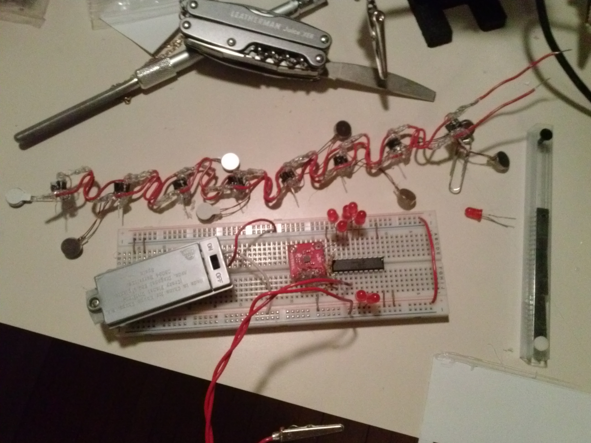
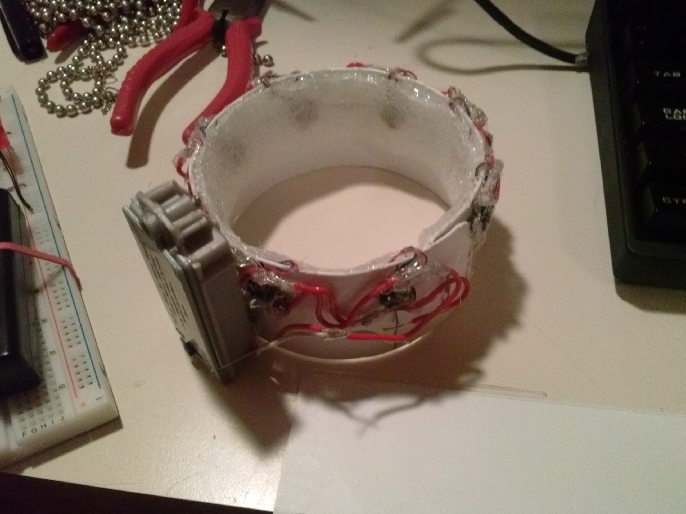
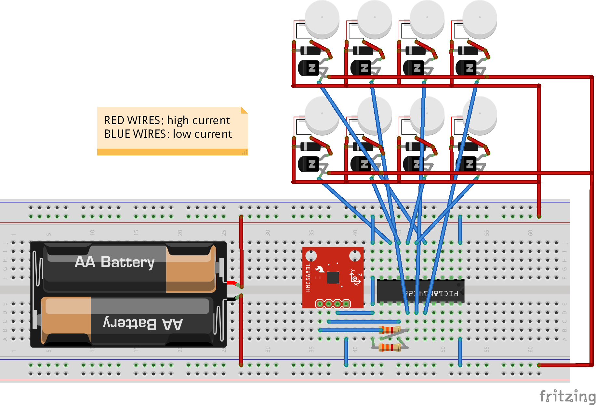

SeventhSense
============
SeventhSense is a simple armband that uses targeted vibrations to give the wearer the ability to sense the direction and magnitude of magnetic fields.

This repository contains all the source files needed to build one of these devices, includind all the component datasheets.

See the `Pictures/` directory for more images!

Details
-------

The armband has 8 vibration motors embedded at equally spaced intervals. It is also connected to a 3-axis magnetometer and a microcontroller.

Roughly every second, the microcontroller reads the ambient magnetic field using the magnetometer, and then vibrates one of the motors just long enough for the user to notice.

Over time, the user will develop the ability to unconsciously interpret the signals while wearing the device. Due to the Earth's magnetic field, this allows the user to be aware of the current compass bearing.

The vibration motors indicate the magnetic field as one of 8 possible values: North, Northeast, East, Southeast, South, Southwest, West, and Northwest.

Parts List
----------

| Part                                     | Quantity | Purpose                                         |
|------------------------------------------|----------|-------------------------------------------------|
| Double AAA battery pack with switch      |        1 | Provides power for all the electronics.         |
| PIC18F14K22 microcontroller (20-pin DIP) |        1 | Controls the magnetometer and vibration motors. |
| HMC5883 magnetometer (breakout board)    |        1 | Measures ambient magnetic fields.               |
| 310-101 vibration motor                  |        8 | Subtly notifies the user.                       |
| IN4001 rectifier diode                   |        8 | Flyback diode to protect delicate  circuitry.   |
| 2N4401 NPN transistor                    |        8 | High current microcontroller-actuated switch.   |
| Resistor (3300 Ohms)                     |        2 | Pull-up resistor for I2C communication lines.   |
| Plastic sheeting                         | 30cm*5cm | Base material for armband.                      | ;wip; measure this
| Insulated electrical wire                |      ~1m | Connecting components together.                 |
| Insulated electrical wire                |      ~1m | Connecting components together.                 |

See the [parts list](Parts List.html) for a detailed bill of materials.

Tools Needed
------------

| Part                    | Quantity |
|-------------------------|----------|
| Soldering Iron + solder |        1 |
| Hot Glue Gun + hot glue |        1 |
| Scissors                |        1 |
| Pliers                  |        1 |

Building
--------

Refer to the [Fritzing design file](Design.fzz) for detailed electronic schematics.

1. Put together the vibration motor modules: each module has a transistor, a flyback diode, and a vibration motor.
    * First wrap the legs of the components together, then solder them together.
    * I personally smothered each module in hot glue as well so each one is individually waterproof.
    * Each module should have a power lead from the negative terminal of the flyback diode.
    * Each module should have a ground lead from the transistor emitter.
    * Each module should have a control lead from the transistor base.
    * This allows the main circuit to be simpler and makes the band have a lower profile.
2. Solder the power leads together and all the ground leads together for all the modules.
    * Make sure to separate them with wires that are at least 1/8 the outer circumference of the armband in length. This ensures that the resulting strip of modules will fit around the armband.
    * This is another good time to go crazy with the hot glue - make sure it's waterproof!
    * This is a good time to test the modules to make sure they all work.
3. Make an armband. Pad the inside with closed cell foam.
    * I used a stiff plastic that came from a set of window blinds. Some people may prefer fabric bands, but I find that they are not as durable.
    * Make sure the armband fits on the upper arm - use on the lower arm results in awkward placement when putting one's arms on a desk or table.
    * Make sure it is closed cell foam - otherwise the foam will not survive extended wear while wet. Using rubber supports is also effective but is not breathable and may irritate some people's skin.
4. Glue the strip of modules to the armband.
    * It is helpful to mark out the exact locations before gluing to ensure the modules are evenly aligned.
    * In my version, the transistor/diode of each module is on the outside of the band, and the vibration motor is fitted to the inside.
5. Build the controller circuit (the electronics excluding the transistors, diodes, and vibration motors) using the Fritzing design file.
    * Program the microcontroller using the 
    * The microcontroller has its pins bent outwards, and the rest of the circuit is built around it.
    * The microcontroller pins that lead to the motor modules are left free at this point.
    * The pictures make a good reference for my compact version.
    * The battery pack should have long enough wires that it can be adjusted in a suitable position on the armband later.
    * The magnetometer should be kept away from the motors, which contain magnets, and any high current wires, which are marked in red, since they produce non-negligible magnetic fields.
6. Connect the correct microcontroller pins to the motor modules.
    * Microcontroller pins are delicate, and it is a good idea to immediately smother freshly soldered solder joints in glue to improve structural properties.
    * Actually, this is a good time to just cover everything electronic in glue.
    * Leave the wires to the ICSP pins free and accessible from the outside - this allows for reprogramming the firmware afterwards.
7. Glue the controller unit onto the armband and wire the controller pins to the motor modules.
    * The best position seems to be right beside the battery pack, since it is close to the power leads.
    * It is a good idea to cover all the electronics in some material to make the armband look better.
    * Add more hot glue to make it fully waterproof.

Now the armband can be tested. When turned on, the motor corresponding to the direction the armband is facing will vibrate every few seconds.

License
-------

Copyright 2014-2015 Anthony Zhang (Uberi).

The designs created under this project are licensed under the [GNU Affero General Public License](http://www.gnu.org/licenses/agpl-3.0.html).

Basically, this means everyone is free to use, modify, and distribute the files, as long as these modifications are also licensed the same way.